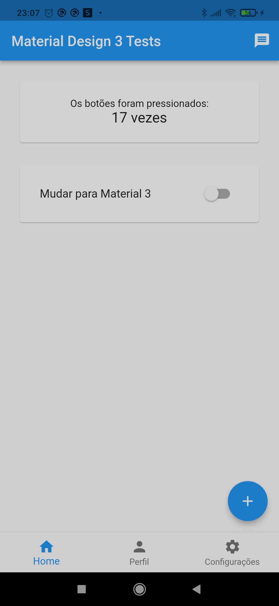
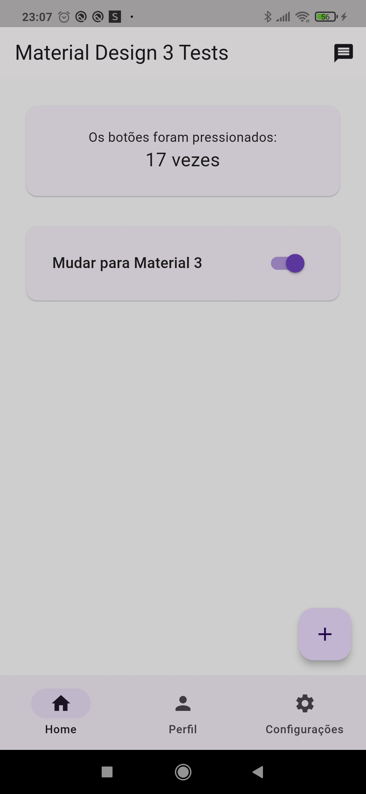

# Material Design 3 Tests

## Descrição

Projeto Flutter que mostra o uso do Material Dsesign 3.

## Preview

<!--  -->

<!--  -->

## Começando

Este projeto é um ponto de partida para uma aplicação Flutter.

Alguns recursos para você começar se este for seu primeiro projeto Flutter:

- [Lab: Escreva seu primeiro aplicativo Flutter](https://docs.flutter.dev/get-started/codelab)
- [Cookbook: exemplos úteis do Flutter](https://docs.flutter.dev/cookbook)

Para obter ajuda para começar com o desenvolvimento do Flutter, consulte o
[documentação online](https://docs.flutter.dev/), que oferece tutoriais,
exemplos, orientação sobre desenvolvimento móvel e uma referência completa de API.

